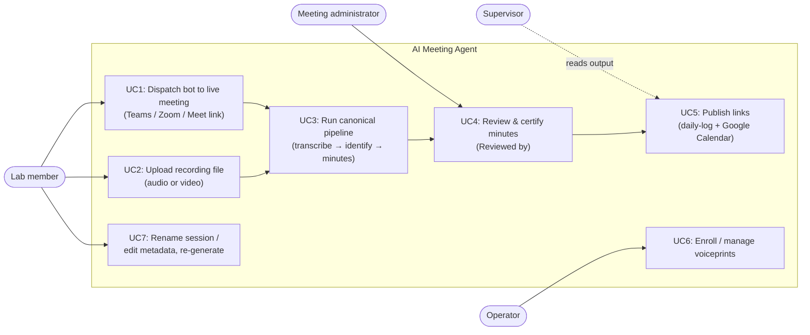
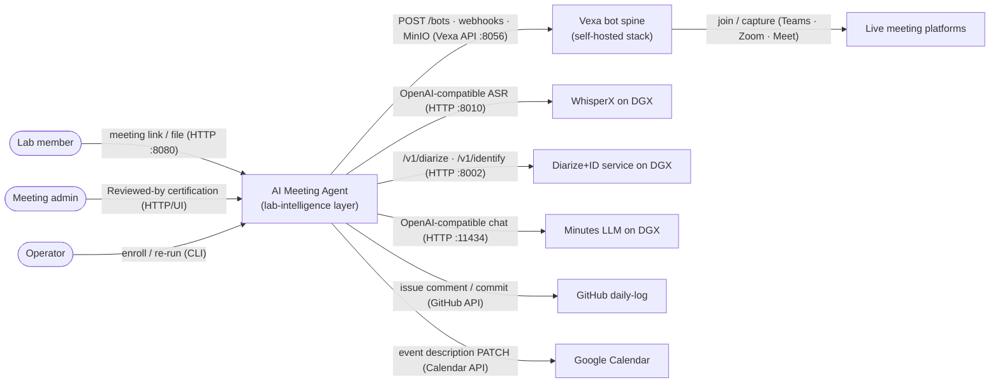
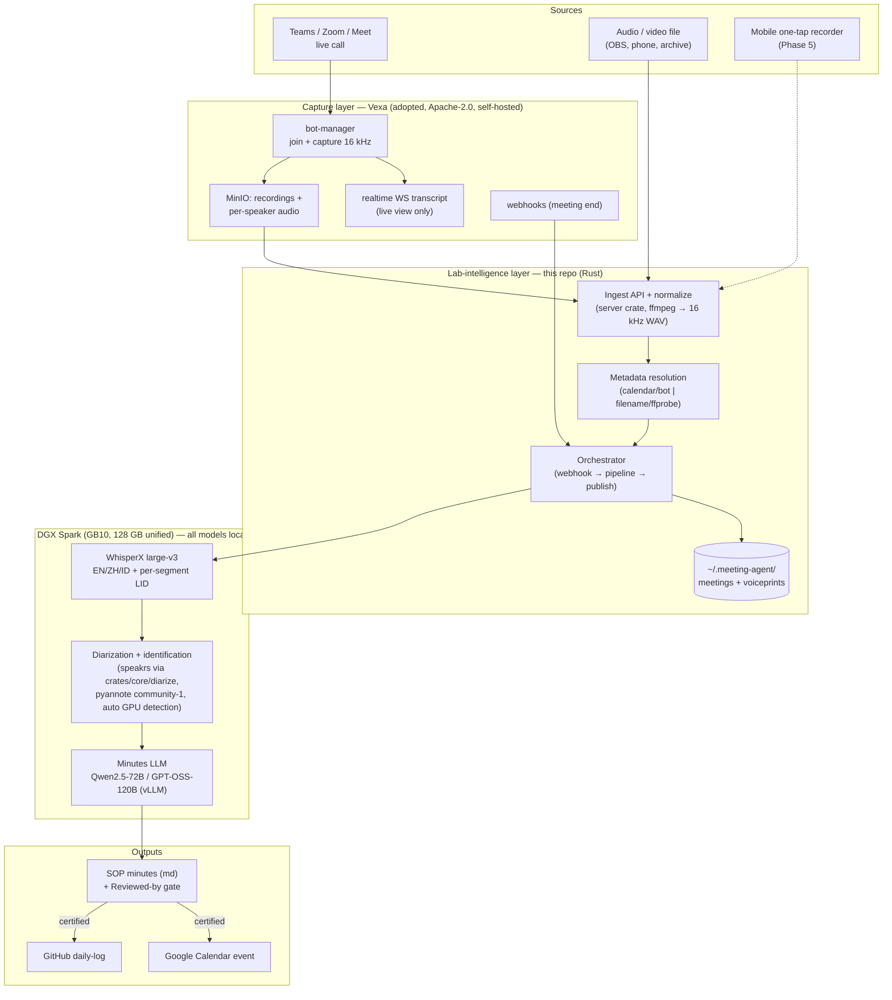
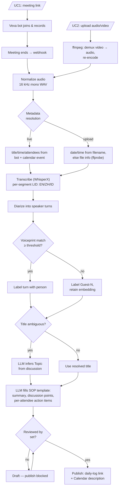
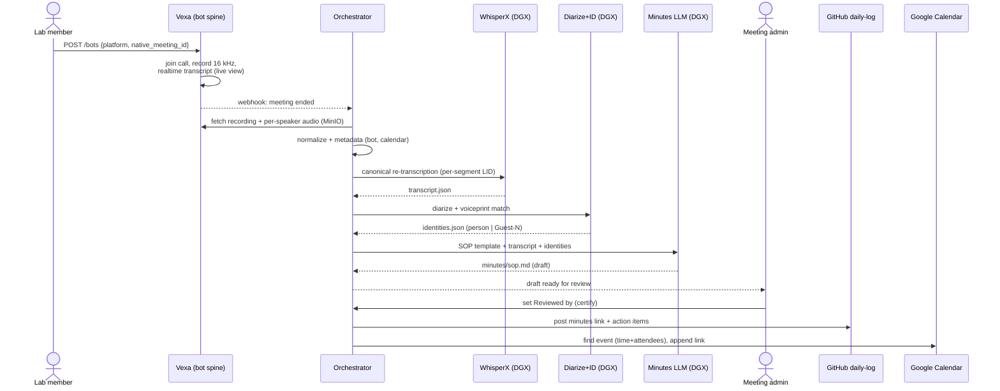
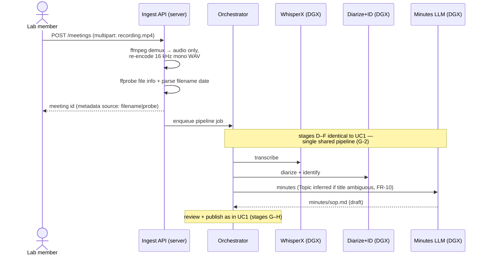
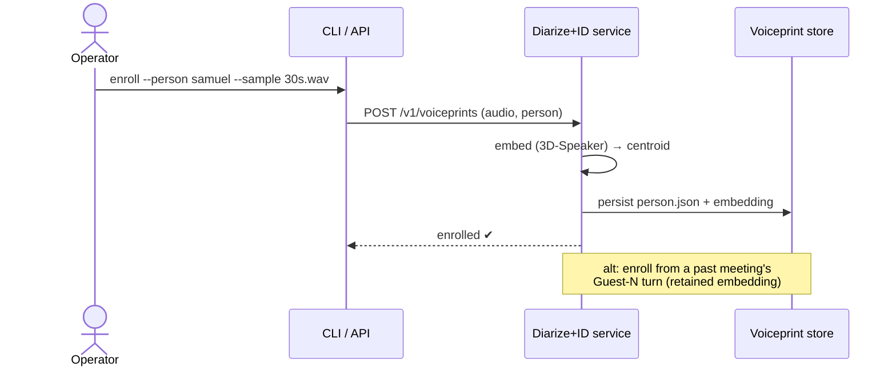
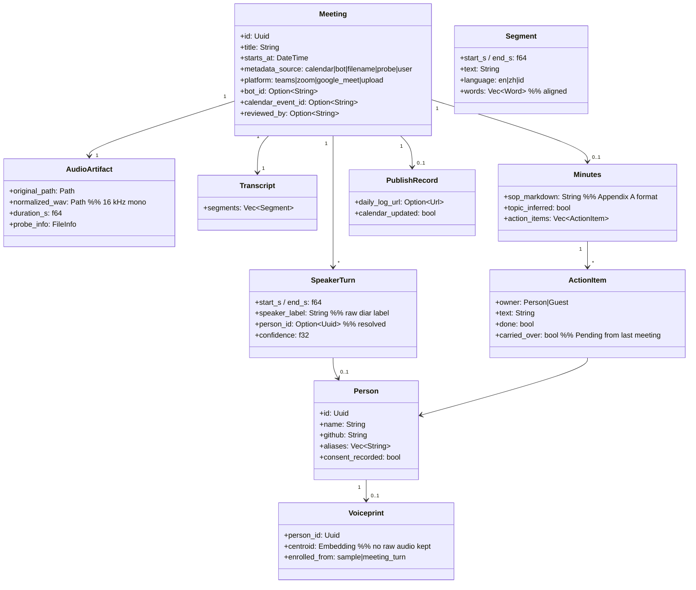
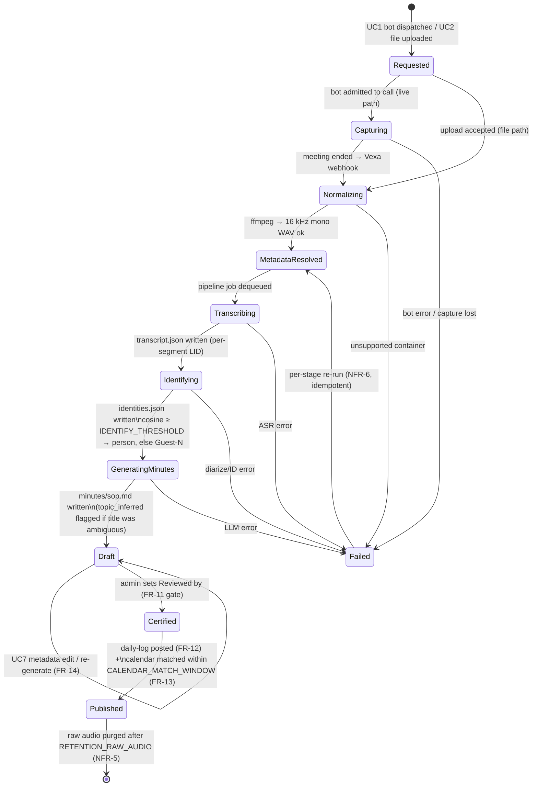
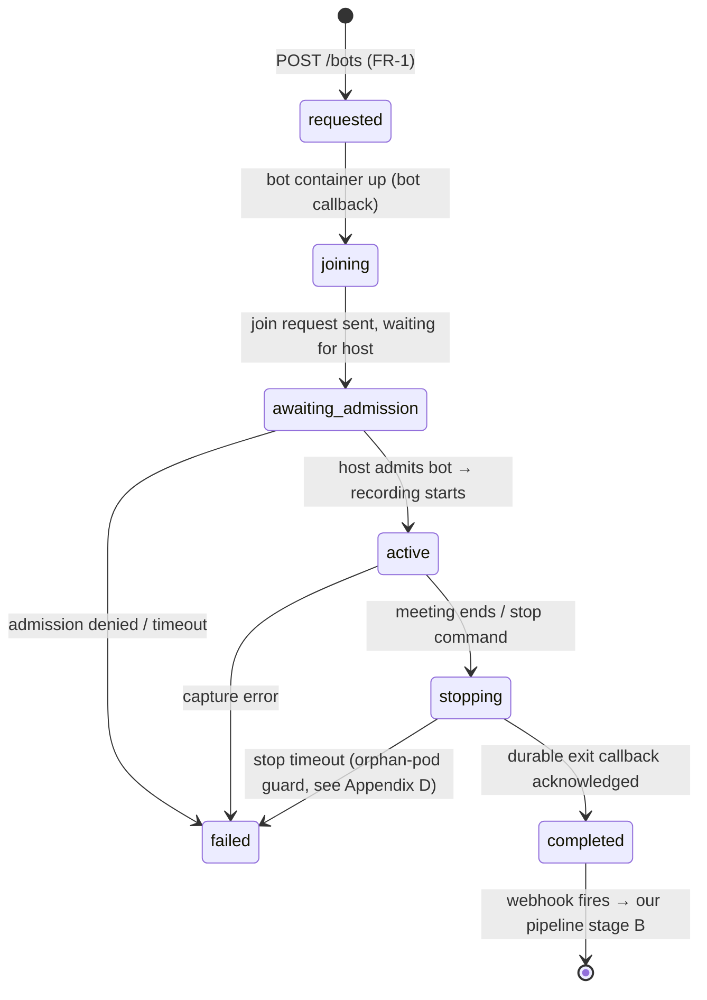

# PRD — AI Meeting Agent (Self-Hosted Meeting Intelligence)

| Field | Value |
| --- | --- |
| **Status** | Draft |
| **Version** | 3.1 (merged workflow + full SOP diagram set incl. state machines + Vexa pattern analysis) |
| **Owner** | ijosh-ch |
| **Reviewers** | Prof. Ray (BMW Lab, NTUST) |
| **Last updated** | 2026-07-07 |
| **Source of truth** | `research.md` *(not yet created — see §12; until then this PRD is hand-maintained)* |
| **Architecture doc** | [§7 Architecture & Constraints](#7-architecture--constraints) |
| **Repo** | `bmw-ece-ntust/ai-meeting-agent` |

> **Diagram placement (llm-prefs `0f193a5`, "repo without `research.md`" rule):** this repo has no `research.md`, so the PRD is the design's single source of truth and carries the **full Mermaid diagram set** per SOP `research.md`: use-case in §4, context + architecture in §7, MSC/flowcharts in §8, class + **state machine** (SOP `ea82291`) in §9. If `research.md` is created later (§12), the detailed diagrams migrate there and §7 keeps only the C4 level-1 context diagram.
>
> **Separation of concerns (ISO/IEC/IEEE 42010):** this PRD states **what** the system must do and **why**. Component internals and installation guides live in `deploy/README.md` and `docs/`.
>
> **Requirement writing rules (ISO/IEC/IEEE 29148 + RFC 2119):** each requirement is singular, unambiguous, verifiable; uses **SHALL/SHOULD/MAY**; carries a stable ID, MoSCoW priority, and an acceptance criterion.

## Table of Contents

- [1. Overview](#1-overview)
- [2. Goals & Success Metrics](#2-goals--success-metrics)
- [3. Non-Goals](#3-non-goals)
- [4. Users & Use Cases](#4-users--use-cases)
- [5. Requirements](#5-requirements)
- [6. System Behavior (merged pipeline)](#6-system-behavior-merged-pipeline)
- [7. Architecture & Constraints](#7-architecture--constraints)
- [8. Flows (MSC & Flowcharts)](#8-flows-msc--flowcharts)
- [9. Data & Parameters](#9-data--parameters)
- [10. Milestones & Status](#10-milestones--status)
- [11. References](#11-references)
- [12. Risks & Open Questions](#12-risks--open-questions)
- [Appendix A — SOP minutes template (verbatim)](#appendix-a--sop-minutes-template-verbatim)
- [Appendix B — Fireflies.ai feature parity & further features](#appendix-b--firefliesai-feature-parity--further-features)
- [Appendix C — Open-source reuse & adjustment plan](#appendix-c--open-source-reuse--adjustment-plan)
- [Appendix D — Vexa pattern analysis (knowledge graph)](#appendix-d--vexa-pattern-analysis-knowledge-graph)

---

## 1. Overview

**Problem.** BMW Lab meetings (Teams room per [SOP `logistics/meeting.md`](https://github.com/bmw-ece-ntust/SOP/blob/master/logistics/meeting.md)) are recorded and minuted manually: OBS/Teams recording → wait for YouTube auto-transcript → paste into an LLM with the SOP prompt → hand-edit → commit → link from the daily-log. This is slow, error-prone, loses speaker attribution (several people often share one Teams login), and the audio transits third-party services.

**Context.** The lab owns a DGX Spark (GB10, 128 GB unified memory) that can co-host ASR + diarization + a large LLM. The existing Rust workspace (`crates/core|server|cli|diarize`) is a working post-processing pipeline (import → transcribe → diarize → summarize) but cannot capture a live call and only does anonymous diarization.

**Solution.** A **self-hosted, Fireflies.ai-style meeting agent**: a bot (adopted open-source spine, Vexa) joins Teams/Zoom/Meet and captures audio, **or** a user uploads an audio/video recording. Both paths converge into **one canonical pipeline** on the DGX: normalize → resolve metadata → transcribe (EN/ZH/ID incl. code-switching) → diarize + **identify speakers by enrolled voiceprint** ("voice persona") → generate BMW-Lab **SOP-format minutes** with per-attendee action items → human review → auto-post the minutes link to the **GitHub daily-log** and the matching **Google Calendar** event. No meeting audio leaves the lab.

## 2. Goals & Success Metrics

| # | Goal | Metric / target | Verified by |
| --- | --- | --- | --- |
| G-1 | Bot captures live Teams/Zoom/Meet meetings, self-hosted | Join success ≥ 95% across test calls on all 3 platforms | Phase-0/4 test matrix |
| G-2 | One canonical pipeline serves both live-bot and file-upload ingest (no duplicated logic) | Same pipeline code path from "normalized audio" onward; 0 duplicated stages | Code review + integration test running both sources through one job queue |
| G-3 | EN/ZH/ID transcription incl. intra-recording code-switching, on DGX | CER ≤ Whisper large-v3 baseline on the lab code-switch eval set | Lab eval set benchmark |
| G-4 | Speaker **identification** (voiceprint), not just diarization | ID accuracy ≥ 90% on enrolled members; false-match ≤ 5% | Labeled lab meeting replay |
| G-5 | Minutes in the exact SOP markdown template with per-attendee action-item checkboxes | Template diff = 0 vs `SOP/logistics/meeting.md`; ≥ 80% of action items accepted without owner correction | Template conformance test + reviewer tally |
| G-6 | Post-meeting automation: daily-log + Google Calendar link-back | Minutes → both targets with a single human action (the `Reviewed by` certification) | End-to-end demo |
| G-7 | Privacy: no third-party SaaS in the audio/LLM path | 0 external calls carrying audio/transcript (egress audit) | Network audit on the deploy host |

## 3. Non-Goals

- **Not building our own meeting-bot browser automation** — adopt Vexa (Appendix C); building join/capture from scratch is the most brittle part and already solved.
- **Not a public multi-tenant SaaS** — single lab, self-hosted.
- **No video-content analysis (slide OCR, screen understanding) in v1** — video files are accepted as *input* but only their audio track is used (§6); the frames are discarded after demux.
- **No cloud STT/LLM** — everything on the DGX by lab policy (G-7).
- **No realtime in-call captions in v1** — Vexa's realtime WS transcript exists but surfacing it is Phase 6.

## 4. Users & Use Cases

**Actors** (from the meeting SOP):

- **Lab member** — dispatches the bot or uploads a recording; reads minutes; receives action items.
- **Meeting administrator** — owns minutes accuracy; certifies LLM output by filling `Reviewed by`.
- **Supervisor (Prof. Ray)** — consumes minutes + action items; needs correct per-person attribution.
- **Operator** — enrolls voiceprints, manages config, re-runs jobs (CLI).

### Use Case Diagram



**User stories** (one per use case; flows in §8):

- **UC1** — As a *lab member*, when a meeting starts, I paste the meeting link so the system's bot joins, records, and later produces certified minutes, so that nobody takes notes manually.
- **UC2** — As a *lab member*, when I have an offline recording (audio **or video**, e.g. an OBS capture or a phone memo), I upload the file and get the identical minutes pipeline, so that past/in-person meetings are first-class.
- **UC3** — As the *system*, when normalized audio + metadata exist, I run one pipeline regardless of the source, so that live and uploaded meetings never diverge in quality or format.
- **UC4** — As the *meeting administrator*, when minutes are generated, I review and set `Reviewed by`, so that only certified minutes are published (SOP rule: LLM output stays a draft until human-verified).
- **UC5** — As the *system*, when minutes are certified, I post the minutes link to the GitHub daily-log and into the matching Google Calendar event description, so that follow-up is automatic.
- **UC6** — As the *operator*, when a new member joins, I enroll ≥ 30 s of their speech, so that future meetings label their turns by name — even when several people share one Teams login.
- **UC7** — As a *lab member*, when a session title/metadata is wrong or ambiguous, I rename/edit it and re-generate minutes on demand.

## 5. Requirements

### 5.1 Functional

| ID | Requirement (SHALL/SHOULD/MAY) | Priority | Acceptance criterion | Source |
| --- | --- | --- | --- | --- |
| FR-1 | The system SHALL dispatch a bot to a Teams, Zoom, or Google Meet meeting when given the meeting share link. | Must | `POST /bots {platform, native_meeting_id}` results in the bot visibly joined to a test call on each platform. | UC1 |
| FR-2 | The bot SHALL capture meeting audio (16 kHz) and persist the raw recording for reprocessing. | Must | After a test call, the raw audio object exists in storage and replays intelligibly. | UC1 |
| FR-3 | The ingest API SHALL accept uploaded audio files and video files, and SHALL extract/convert any input to 16 kHz mono WAV before the pipeline. | Must | Uploading `.mp4`, `.mkv`, `.m4a`, `.mp3`, `.wav` each yields a normalized WAV artifact; video frames are not retained. | UC2 |
| FR-4 | On file upload, the system SHALL extract file information (container timestamps, duration, creation time) and SHALL parse the meeting date/time from the file name when present. | Must | For a file named `2026-07-01_lab-meeting.mp4`, `meeting.json` carries `starts_at = 2026-07-01` sourced `filename`; for a file without a parsable name, `starts_at` falls back to file metadata with source `probe`. | UC2 |
| FR-5 | The pipeline SHALL transcribe EN, ZH, and ID speech — including code-switching within one recording — with per-segment language tags, running on the DGX. | Must | Lab eval recording yields segments tagged with ≥ 2 languages and CER ≤ baseline (G-3). | UC3 |
| FR-6 | The pipeline SHALL diarize the audio into speaker turns independent of platform login (splitting by voice, not by account). | Must | A 2-speakers-on-1-login test recording yields ≥ 2 distinct speaker turns. | UC3 |
| FR-7 | The pipeline SHALL match each diarized turn against the enrolled voiceprint DB and label it with the person's name, or `Guest-N` when below the match threshold. | Must | Replay of a labeled lab meeting: ≥ 90% turns correctly named, unknowns bucketed as `Guest-N` with embeddings retained. | UC3, UC6 |
| FR-8 | The system SHALL provide voiceprint enrollment/management (register from a ≥ 30 s sample or from a past meeting turn; list, merge, delete). | Must | CLI/API round-trip: enroll → appears in list → identifies the person on the next run → delete removes it. | UC6 |
| FR-9 | The system SHALL generate minutes in the exact BMW-Lab SOP markdown template (Appendix A), including `Pending from last meeting` and per-attendee `Action Items` checkboxes. | Must | Generated file diffs clean against the template skeleton in `SOP/logistics/meeting.md`; every action item sits under an attendee with a `- [ ]` checkbox. | UC3, SOP |
| FR-10 | When the meeting title is missing or ambiguous, the system SHALL infer the `Topic` from the transcript content, and SHALL fill `Date`/`Time` from the resolved metadata (calendar/bot for live; filename/file info for uploads). | Must | An upload named `rec001.mp4` produces minutes with a non-empty inferred `Topic` and a `## yyyy/mm/dd-hh.mm` heading from file metadata. | UC2, UC7 |
| FR-11 | Generated minutes SHALL remain a draft until a human fills `Reviewed by`; publication (FR-12/13) SHALL NOT occur before certification. | Must | Publishing is blocked while `reviewed_by` is empty; unblocked immediately after it is set. | UC4, SOP |
| FR-12 | On certification, the system SHALL post the minutes link (and per-person action items) to the GitHub daily-log target. | Must | The configured issue/repo shows the minutes link within 1 min of certification. | UC5 |
| FR-13 | On certification, the system SHALL locate the matching Google Calendar event (time window + attendees) and append the minutes link to its description. | Must | The calendar event description contains the link; no-match falls back to a logged warning, not an error. | UC5 |
| FR-14 | The system SHALL support session rename / metadata edit after the fact, with minutes re-generation on demand. | Should | Rename + re-generate produces updated minutes without re-transcribing. | UC7 |
| FR-15 | The system SHOULD retain the file-import CLI path and expose the same pipeline over HTTP API. | Should | `meeting-agent import <file>` and `POST /meetings` (multipart) reach the same pipeline stages. | UC2 |
| FR-16 | The system MAY provide a mobile one-tap recorder for in-person meetings feeding the same ingest API. | Could | Phone recording lands in the ingest API and produces minutes unchanged. | UC2 (later) |
| FR-17 | The system MAY surface Vexa's realtime transcript (live captions / MCP hooks). | Could | Live WS transcript visible during a test call. | UC1 (later) |

### 5.2 Non-Functional

| ID | Requirement | Priority | Acceptance criterion | Source |
| --- | --- | --- | --- | --- |
| NFR-1 | All ASR, diarization, identification, and LLM inference SHALL run on lab hardware (DGX Spark); no audio, transcript, or minutes content SHALL be sent to third-party services. | Must | Egress audit during a full pipeline run shows no external calls carrying meeting content. | G-7 |
| NFR-2 | Deployment SHALL fit the DGX Spark: GB10, 128 GB unified memory, aarch64; co-hosted models (Whisper large-v3 ≈ 3 GB + 120B-class MXFP4 LLM ≈ 65 GB) SHALL fit concurrently. | Must | `docker compose up` on the DGX brings up all services; memory headroom logged. | deploy/README |
| NFR-3 | A 1-hour recording SHALL complete the full pipeline (normalize → minutes draft) in ≤ 30 min wall-clock on the DGX. | Should | Timed benchmark on the eval recording. | G-2 |
| NFR-4 | Voiceprint data SHALL be collected only with explicit consent and covered by a lab retention policy; store embeddings rather than raw enrollment audio where possible. | Must | Consent record exists per enrolled person; policy doc linked from README. | §12 legal |
| NFR-5 | Raw meeting audio retention SHALL follow the lab retention policy (duration TBD, §12); transcripts/minutes are kept indefinitely in the repo. | Must | Cleanup job honors the configured retention window. | §12 |
| NFR-6 | The pipeline SHALL be idempotently re-runnable per stage (re-transcribe, re-identify, re-generate minutes) without corrupting prior artifacts. | Should | Re-running any stage overwrites only that stage's artifact. | UC7 |

## 6. System Behavior (merged pipeline)

**Workflow confirmation & de-duplication.** The two user workflows (live meeting; file upload) shared 4 of their steps verbatim — *transcribe → LLM analysis → minutes → publish*. v3 merges them: everything from **Normalize** onward is **one pipeline**; only the two *ingest adapters* differ. The upload path's "analyze the file information" and "get date from the file name" collapse into the shared **Metadata resolution** stage, which for the live path draws from the calendar/bot instead. "Voice persona" is the **speaker identification** stage (diarize + voiceprint match) and likewise runs identically for both sources.

| Stage | Inputs (source, interface) | Decision rule | Outputs (target, interface) |
| --- | --- | --- | --- |
| **A. Ingest — live bot** | Meeting share link (user, API/CLI) | platform ∈ {teams, zoom, google_meet} → dispatch Vexa bot; on meeting end, webhook fires | Raw audio + participant events + realtime transcript (Vexa MinIO/WS) |
| **A′. Ingest — file upload** | Audio/video file (user, multipart API / CLI import) | any container → ffmpeg demux/re-encode; video ⇒ audio track only | Normalized 16 kHz mono WAV + ffprobe file info |
| **B. Normalize** | Raw audio (either adapter) | resample/mixdown to 16 kHz mono WAV | Canonical audio artifact |
| **C. Metadata resolution** | Bot/calendar metadata (live) or filename + file info (upload); user edits (UC7) | precedence: user edit > calendar/bot > filename pattern `yyyy-mm-dd…` > container creation time; title ambiguous ⇒ flag for LLM topic inference (stage F) | `meeting.json` (title, starts_at + source, platform, attendees-as-reported) |
| **D. Transcription** | Canonical audio (DGX WhisperX) | VAD-segment → per-segment language ID (EN/ZH/ID) → word-aligned transcript; realtime Vexa transcript is the *live view* only, this pass is canonical | `transcript.json` (segments, words, per-segment lang) |
| **E. Identification** | Transcript + audio (diarize svc) | diarize turns → embed (3D-Speaker) → cosine vs enrolled centroids; ≥ threshold ⇒ person, else `Guest-N` (embedding retained) | `diarization.json`, `identities.json` |
| **F. Minutes generation** | Transcript + identities + metadata (DGX LLM) | fill SOP template (Appendix A); topic missing/ambiguous ⇒ infer from discussion content; action items keyed to identified attendees; unresolved owner ⇒ flag for review | `minutes/sop.md` (draft) |
| **G. Review gate** | Draft minutes (admin, UI/repo) | `Reviewed by` empty ⇒ block publish; set ⇒ certified | Certified minutes |
| **H. Publish** | Certified minutes (orchestrator) | post link to daily-log target; find Calendar event by time-window + attendees ⇒ append link to description; no match ⇒ warn | Daily-log comment/commit; updated Calendar event |

## 7. Architecture & Constraints

Hybrid: a proven open-source **bot spine (Vexa)** for join/capture/realtime ASR, plus the **lab-intelligence layer** (this repo) owning the differentiators — voiceprint identity, SOP minutes, daily-log, calendar.

### Context Diagram (C4 level 1)

One system, its actors, and every external component with the interface each edge carries (per the llm-prefs PRD context-diagram rule):



### System Architecture (Component Diagram)



### Components & pinned versions

| Component | Implementation | Version (pinned) | Role | Guide |
| --- | --- | --- | --- | --- |
| Bot spine | Vexa (`Vexa-ai/vexa`) | v0.10.6 | Join Teams/Zoom/Meet, capture, realtime ASR, webhooks, per-speaker audio | Vexa self-host docs; `deploy/README.md` |
| Ingest/API | `crates/server` (Axum) + `crates/core` | this repo | Upload + normalize + metadata + job queue; OpenAPI at `/docs` | `deploy/README.md` |
| Operator CLI | `crates/cli` | this repo | import, enroll, dispatch, re-run | `README.md` |
| ASR | WhisperX (Whisper large-v3) | large-v3 | Canonical word-aligned multilingual transcription | `deploy/` compose |
| Diarization | `crates/core/diarize` (speakrs, pyannote community-1) | this repo | Speaker turns; auto GPU detection (CPU fallback) | `docs/` |
| Speaker ID | 3D-Speaker embeddings + voiceprint store | ERes2NetV2 | Turn → person (voice persona) | `docs/` |
| Minutes LLM | Qwen2.5-72B *(alt: GPT-OSS-120B)* | MXFP4/AWQ build | SOP minutes + action-item extraction | `deploy/` compose |
| Publisher | Orchestrator (Phase 4) | — | daily-log + Calendar link-back | TBD |

**Design constraints**

- All inference on the DGX (NFR-1/2); Vexa's `TRANSCRIPTION_SERVICE_URL` is pointed at our DGX WhisperX so even the realtime pass stays local.
- Vexa is run as a sibling Docker stack; our services attach to its `vexa` network. We integrate only via its public API (`POST /bots`, `GET /transcripts/...`, webhooks, MinIO) — **no Vexa forks** unless Appendix C says so.
- Minutes format is fixed by `SOP/logistics/meeting.md` — the template is a compliance target, not a style suggestion (FR-9).
- Ports: Vexa gateway `:8056`; server `:8080`; diarize `:8002`; WhisperX `:8010`; LLM `:11434`.

## 8. Flows (MSC & Flowcharts)

### 8.1 High-level flowchart — merged pipeline

The merge point after **Normalize + Metadata** is the de-duplication guarantee (G-2): downstream stages cannot tell which source produced the audio.



### 8.2 MSC — UC1: live meeting via bot



### 8.3 MSC — UC2: file upload (audio or video)



### 8.4 MSC — UC6: voiceprint enrollment



## 9. Data & Parameters

### Class Diagram



### Storage layout (extends current file-based store)

```
~/.meeting-agent/
├── config.json
├── voiceprints/{person_id}/          # person.json + embedding centroid (no raw audio)
└── meetings/{id}/
    ├── meeting.json                  # + platform, bot_id, calendar_event_id, reviewed_by, metadata_source
    ├── audio/{original} + normalized.wav
    ├── transcript.json               # per-segment language, word timestamps
    ├── diarization.json / identities.json
    ├── minutes/sop.md                # SOP-format minutes (Appendix A)
    └── summaries/…                   # existing templates retained
```

Later: migrate metadata to Postgres (Vexa already requires Postgres/Redis) for cross-meeting/person queries.

### State Machine Diagrams

Per SOP `research.md` (rule added in `ea82291`): after the class diagram, the runtime behavior contract — every long-lived entity's finite states, each transition annotated with its triggering event or parameter (names from [System parameters](#system-parameters)). Reviewers check the code implements exactly these states: no hidden states, no unreachable transitions. `Meeting.status` is a simple enum attribute (no State pattern needed per the SOP rule).

**Meeting session lifecycle (ours — the controlled entity of §6):**



**Vexa bot lifecycle (adopted resource — EXTRACTED from the mirror branch, `services/meeting-api/meeting_api/schemas.py` `MeetingStatus`):**



Our orchestrator subscribes to the bot's terminal transitions (`completed` → start pipeline; `failed` → notify the dispatching member) rather than polling.

### System parameters

| Parameter | Type | Unit | Default | Used by |
| --- | --- | --- | --- | --- |
| `IDENTIFY_THRESHOLD` | f32 (cosine) | — | tuned on lab voices | FR-7 |
| `ENROLL_MIN_SPEECH` | duration | s | 30 | FR-8 |
| `ASR_MODEL` | enum | — | whisper-large-v3 | FR-5 |
| `SEGMENT_LID` | bool | — | true (EN/ZH/ID) | FR-5 |
| `MINUTES_MODEL` | enum | — | qwen2.5-72b | FR-9/10 |
| `CALENDAR_MATCH_WINDOW` | duration | min | ±30 | FR-13 |
| `RETENTION_RAW_AUDIO` | duration | days | TBD (§12) | NFR-5 |

## 10. Milestones & Status

| Phase | Scope | Exit criterion | Status |
| --- | --- | --- | --- |
| 0 — Foundations | Vexa self-hosted; DGX WhisperX wired; `diarize` refactor scaffold | Bot joins a test call; audio lands in ingest API | ⏳ blocked on DGX access (no Docker/cargo on dev laptop) |
| 1 — Canonical pipeline | WhisperX + diarization, word-aligned EN/ZH/ID | Code-switch recording transcribed with turns on DGX | ❌ |
| 2 — Identity | Voiceprint enroll DB + cosine match + `Guest-N` | Lab members auto-labeled; shared-login case resolved | ❌ |
| 3 — SOP minutes | LLM minutes in exact template + action items + review gate | One-click SOP minutes from any recording | ❌ |
| 4 — Automation | Orchestrator: webhook → pipeline → daily-log + Calendar | End-to-end with single human certification | ❌ |
| 5 — Mobile (opt) | One-tap in-person recorder → same ingest | Phone recording → minutes unchanged | ❌ |
| 6 — Realtime (opt) | Live captions / MCP hooks off Vexa WS | Live transcript during a call | ❌ |

Pre-pivot pipeline work (import/transcribe/diarize/summarize, OpenAPI, deploy blueprint) is ✅ — see `TODO.md` and git history.

## 11. References

1. BMW Lab SOP — Meeting Guideline: `bmw-ece-ntust/SOP` → `logistics/meeting.md` (minutes template, administrator workflow).
2. BMW Lab SOP — Research documentation standard: `bmw-ece-ntust/SOP` → `research.md` (required diagram set: use case, architecture, MSC, flowchart, class).
3. `llm-prefs/prd/PRD-template.md` — PRD structure, ISO/IEC/IEEE 29148 + RFC 2119 requirement rules.
4. Vexa — `Vexa-ai/vexa` (v0.10.6), Apache-2.0: bot API, webhooks, per-speaker audio, `TRANSCRIPTION_SERVICE_URL`.
5. WhisperX — word-level alignment + VAD on faster-whisper.
6. 3D-Speaker / WeSpeaker / NeMo TitaNet — speaker embedding models.
7. Fireflies.ai product docs — feature parity baseline (Appendix B).
8. Open Research Playbook — meeting-notes template (action-item review rule).

## 12. Risks & Open Questions

**Risks**

| Risk | Mitigation |
| --- | --- |
| Bot fragility (platform UI / anti-bot changes) | Adopt Vexa (community maintains adapters); keep Attendee as fallback spine (Appendix C) |
| Code-switch ASR errors (rapid intra-sentence EN/ZH/ID) | Per-segment LID; lab eval set before locking the model; fine-tune path on lab audio |
| Voiceprint false matches | Conservative threshold + `Guest-N` bucket + human confirmation on first sighting; ≥ 30 s enrollment |
| Legal/consent (BIPA-style; Fireflies was sued over voiceprints, Dec 2025) | Consent gate + retention policy **before** identification on real meetings (NFR-4); store embeddings, not raw audio |
| DGX resource contention (ASR + diarize + LLM co-hosted) | Queue heavy minutes jobs behind realtime capture; measure headroom (NFR-2) |
| Ambiguous-title inference produces a wrong Topic | Topic marked `topic_inferred=true` and surfaced in the review gate — admin must confirm before certifying |

**Open questions**

1. Platform priority #1 for the bot — Teams, given the SOP Teams room?
2. Daily-log target: progress-plan issue thread, a repo file, or both?
3. Google Calendar: which account owns the events; service-account vs OAuth?
4. Retention window for raw meeting audio (`RETENTION_RAW_AUDIO`)?
5. `research.md` for this repo per SOP — create it and move §7–§9 diagrams there, then regenerate this PRD via `prd-extract.py`?

---

## Appendix A — SOP minutes template (verbatim)

Compliance target for FR-9/FR-10. Source of truth: `bmw-ece-ntust/SOP` → `logistics/meeting.md` § "AI-Powered Meeting Minutes Generation". The LLM prompt is built exactly as the SOP specifies:

````
Generate meeting minutes from `<source name>`, focusing on the following topics:

Format the output using the specified GitHub markdown template. Ensure all discussion points are detailed, comprehensive, and categorized under their respective topics. Identify and list all actionable items clearly with checkboxes.

Meeting Context:

• Date: (Get from the file name)

• Time:

• Attendees:

Desired GitHub Markdown Format:

```
## yyyy/mm/dd-hh.mm

- *Reviewed by*: <GitHub username>   <!-- fill in to certify you verified these LLM-generated minutes -->
- *Recording*: <recording link>
- *Attendees*:
- *Topic*:
- *Summary*:

- *Pending from last meeting*:
  - [ ] <carried-over action item — reviewed at the start of the meeting>

- *Discussion Points*
  - <point-1>
  - <point-n>

- *Action Items*:
  - <attendee-n>:
    - [ ] <action-item-1>
    - [ ] <action-item-n>
```

---
MEETING TRANSCRIPTION:
# Copy the meeting text transcription bellow:
````

**System-supplied slot mapping** (how the pipeline fills the prompt):

| Slot | Live-bot source | File-upload source |
| --- | --- | --- |
| `<source name>` | meeting title (calendar/bot) | file name |
| Date / Time | bot join time / calendar event | filename pattern → ffprobe creation time (FR-4) |
| Attendees | identified persons (FR-7) ∪ platform participant list | identified persons only |
| Recording link | Vexa recording URL (lab storage) | uploaded-file storage URL |
| Topic | calendar title; if ambiguous ⇒ inferred (FR-10) | filename title; if ambiguous ⇒ inferred (FR-10) |
| Pending from last meeting | previous certified minutes' unchecked action items, carried over automatically | same |

> Note: the current SOP template includes the `*Pending from last meeting*` block (per the Open Research Playbook rule "begin every meeting by reviewing pending action items"). It is part of the compliance target even though older copies of the prompt omit it.

## Appendix B — Fireflies.ai feature parity & further features

Baseline from [fireflies.ai](https://fireflies.ai/) and its [knowledge base](https://guide.fireflies.ai/articles/1193528158-what-is-fireflies-ai) (see also [G2 overview](https://www.g2.com/products/fireflies-ai/reviews)).

| Fireflies feature | This project | Where |
| --- | --- | --- |
| Bot auto-joins Zoom/Meet/Teams/Webex | ✅ v1 (Teams/Zoom/Meet via Vexa) | FR-1 |
| Transcription, 100+ languages | ✅ scoped to EN/ZH/ID **incl. code-switching** (Fireflies transcribes per-meeting language; intra-meeting mixing is our edge) | FR-5 |
| Speaker labels | ✅ **stronger**: voiceprint *identification*, resolves shared-login case Fireflies can't | FR-6/7 |
| AI summaries + action items | ✅ in the exact lab SOP template, per-attendee checkboxes | FR-9 |
| Mobile app for in-person meetings | 🕐 Phase 5 | FR-16 |
| Upload audio/video files | ✅ v1, same pipeline | FR-3 |
| Integrations (CRM, Slack, Asana…) | ✅ scoped to the two the lab uses: GitHub daily-log + Google Calendar | FR-12/13 |
| AskFred (chat with your meetings) | ➕ proposed below | — |
| Conversation analytics (talk-time, topics) | ➕ proposed below | — |
| Soundbites / clips | ➕ proposed below | — |
| Smart search across meetings | ➕ proposed below | — |
| Realtime notes | 🕐 Phase 6 (Vexa WS) | FR-17 |
| Data residency | ✅ **stronger**: fully self-hosted, nothing leaves the lab | NFR-1 |

**Further features worth adding after Phase 4** (each maps onto artifacts the pipeline already produces):

1. **"Ask the archive" chat (AskFred equivalent)** — index `transcript.json` + minutes into a local RAG store; answer "what did we decide about X?" across meetings. Cheap: the minutes LLM is already resident on the DGX.
2. **Talk-time & participation analytics** — per-person speaking time straight from `identities.json`; useful for the weekly-discussion admin report.
3. **Action-item tracker** — since items are checkboxes in GitHub, poll their state and roll unfinished ones into the next meeting's `Pending from last meeting` automatically (closes the SOP loop).
4. **Soundbite links** — word-level timestamps (WhisperX) allow deep links `minutes → audio offset`; embed `t=` links per discussion point.
5. **Cross-meeting person page** — every meeting/turn/action item for one member, keyed by the voiceprint `person_id` (feeds thesis-progress reviews).
6. **Custom vocabulary** — lab jargon list (O-RAN, rApp, FlexRIC, …) as ASR hotwords/initial-prompt to cut domain-term errors.

## Appendix C — Open-source reuse & adjustment plan

Everything below is licensed for self-hosted use and modification. Each row's **Adjustment plan** is written so another LLM can execute it directly.

| # | Project (license) | Role | Adjustment plan (actionable) |
| --- | --- | --- | --- |
| 1 | **Vexa** — `Vexa-ai/vexa`, v0.10.6 (Apache-2.0) | Bot spine: join, capture, realtime ASR, webhooks | **Adopt, don't fork.** (a) `make all` self-host (Docker Compose, needs Postgres/Redis/MinIO — bundled). (b) Set env `TRANSCRIPTION_SERVICE_URL` → our WhisperX `:8010` so realtime ASR runs on the DGX. (c) Register a webhook pointing at our orchestrator for meeting-end. (d) Read recordings + per-speaker audio from its MinIO bucket. (e) Optional: reuse its bundled `calendar-service` and `mcp` server instead of writing ours — evaluate in Phase 4 before building FR-13 from scratch. |
| 2 | **Attendee** — `attendee-labs/attendee` (OSS) | Fallback bot spine | **Hold in reserve.** Only if Vexa gaps on a platform (most likely Teams): stand it up with the same webhook contract; the orchestrator is source-agnostic from stage B onward, so no pipeline change. |
| 3 | **WhisperX / faster-whisper** (BSD/MIT) | Canonical ASR | (a) Serve large-v3 behind an OpenAI-compatible endpoint on `:8010` (see `deploy/`). (b) Enable VAD segmentation + word alignment. (c) Add per-segment language re-detection restricted to {en, zh, id}. (d) Add lab hotword list (Appendix B #6). |
| 4 | **speakrs** (MIT) | Diarization | Integrated in `crates/core/diarize` using pyannote community-1 pipeline. In-process execution via `OwnedDiarizationPipeline` with lazy initialization (`OnceLock`). Automatic GPU detection (`ExecutionMode::auto`) with CPU fallback. Models auto-download from HuggingFace (`avencera/speakrs-models`) on first use; optional offline mode via `DIARIZE_MODEL_DIR`. Graceful degradation: logs warning and proceeds without speaker labels on failure. |
| 5 | **3D-Speaker / WeSpeaker / TitaNet** (Apache/MIT) | Voiceprint embeddings | Extend `crates/diarize`: (a) expose standalone embedding extraction from an audio span; (b) add `POST/GET/DELETE /v1/voiceprints` persisting `person.json` + centroid to `VOICEPRINT_DIR`; (c) add `POST /v1/identify` = cosine(turn embedding, centroids) with `IDENTIFY_THRESHOLD`, returning person or `Guest-N`. (Matches TODO Phase 2 items.) |
| 6 | **Qwen2.5-72B / GPT-OSS-120B via vLLM** (Apache/MIT) | Minutes LLM | (a) Serve on `:11434`, OpenAI-compatible. (b) Prompt = Appendix A verbatim with the slot-mapping table. (c) Add a JSON-mode side-call to emit structured `action_items[]` for FR-12. (d) A/B the two models on 3 real lab transcripts; pick by reviewer preference. |
| 7 | **Meetily** — `Zackriya-Solutions/meetily` (MIT) | Reference only | **Do not integrate.** Borrow Rust patterns for local ASR orchestration if useful; it has no bot and no identification. |
| 8 | **ffmpeg/ffprobe** (LGPL) | Normalize + file info | Already required on PATH. Ensure video demux path (FR-3) re-encodes rather than stream-copies (matches fix `44ed2a2`); parse `creation_time` for FR-4. |

**Build-vs-reuse summary:** reuse the entire capture layer (1–2) and all models (3–6); **build only** the lab-differentiating layer — voiceprint identity (5's adjustments), SOP minutes generation, review gate, daily-log + Calendar publishing, and the ingest/metadata merge (§6).

## Appendix D — Vexa pattern analysis (knowledge graph)

**Provenance.** The adopted Vexa source (`90e5c72`, VERSION 0.10.6.3.14) is snapshotted on this repo's **`mirror` branch** (commit `9d6647e`); branch model: `main` = final project, `dev` = development, `mirror` = adopted upstream for adaptation. The snapshot was graphified (scope: `services/ contracts/ libs/ packages/ docs/` — 548 code + 147 doc files) into **6,398 nodes / 12,287 edges / 336 communities**; outputs in `graphify-out-vexa/` (`graph.json`, `GRAPH_REPORT.md`).

> **Coverage honesty:** code coverage is complete (full AST pass). Semantic doc extraction covered 63/147 docs (3 of 7 extraction agents finished before a session limit; re-run `/graphify --update` on the clone to complete). The health check flags 1,816 dangling-endpoint edges — mostly references into the unprocessed docs; structural (code) conclusions below are unaffected.

**Patterns extracted, and what each means for our build:**

| # | Pattern (graph evidence) | What Vexa does | Adopt in our layer as |
| --- | --- | --- | --- |
| 1 | **Schema-hub contract** — god nodes `MeetingStatus` (°66), `MeetingCreate` (°76), `Platform` (°49), `MeetingCompletionReason` (°41), all in `meeting-api/schemas.py` | One Pydantic schema module is the shared contract every service imports | Single contract module (Rust types crate) for pipeline stages; §9 class diagram is its spec |
| 2 | **Thin gateway** — god node `api_gateway.forward_request()` (°60) with no business logic | api-gateway only routes/authenticates; logic lives in meeting-api | Integrate at the gateway API only (`POST /bots`, transcripts); never reach into Vexa internals |
| 3 | **Bot callback contract** (community "Bot Callback Contract": `BotStartupCallbackPayload`, `BotStatusChangePayload`, `BotExitCallbackPayload`) | The bot pushes status transitions to meeting-api via typed callbacks — nobody polls the bot | Orchestrator consumes webhooks keyed on the §9 bot state machine's terminal states |
| 4 | **Redis Streams event backbone** (community "Redis Stream Consumers": `consume_redis_stream()`, `consume_speaker_events_stream()`, `claim_stale_messages()`) | Transcript segments + **speaker events** flow through Redis Streams; stale-claim = at-least-once delivery | Consumers must be idempotent (reinforces NFR-6); speaker events are an input to identification |
| 5 | **Outbox for unreliable stops** (`container_stop_outbox.py`; upstream issue #266: 3-of-20 stop DELETEs dropped, orphan pods 12+ min) | Bot stop is eventually-consistent, protected by an outbox + retry | Treat `stopping → completed` as async; never block the pipeline on bot teardown; alert on stuck `stopping` |
| 6 | **Per-speaker audio at capture** (community "Bot Audio Service": `AudioService.createCombinedAudioStream()` / `.createPerSpeakerStreams()` in `vexa-bot/core`) | The bot itself splits per-participant streams during capture | Confirms §13/G-4: voiceprint ID runs on per-speaker audio; shared-login streams still need our re-diarization |
| 7 | **Versioned cross-service contracts** (`contracts/{capture,lifecycle,stt,transcript,webhook}/v1` with recorded fixtures) | Service boundaries are spec'd contract-first, with fixtures as regression tests | Define an `orchestrator↔Vexa` contract file + recorded webhook fixtures before Phase 4 code |
| 8 | **Browser-automation brittleness quarantined** (community "Bot Browser Automation": Playwright CDP args, `getAuthenticatedBrowserArgs()`) | All anti-bot/UI fragility is isolated inside `vexa-bot`, behind the callback contract | Validates the Non-Goal: never build/modify this layer; platform breakage is upstream's to fix |

**Net effect on the roadmap:** Phase 4's orchestrator becomes: subscribe to webhook (pattern 3) → read per-speaker audio from MinIO (6) → run pipeline → publish; with a contract file + fixtures first (7), idempotent consumers (4), and no synchronous dependence on bot teardown (5).
